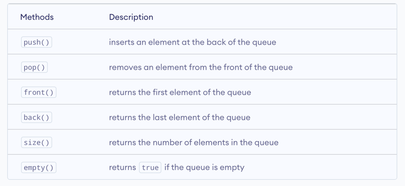

# DATA STRUCTURES CHEAT SHEET
## Arrays

### no library
```c++
#include <iostream>
using namespace std;

void printArray(int array[], int length){
    for (int i = 0; i < length; ++i) {
        printf("At [%d]: %d\n", i, array[i]);
    }
}

int main(int argc, char **argv){
    // initialise an array
    int foo [] = {1, 2, 3, 4};
    int bigArray[100];
    // two-dimensional
    int crazyArray [3][5];
    // assign a value
    bigArray[0] = 7;
    crazyArray[0][0] = 7;
    // print an array
    printArray(foo, 4);
}
```
### library
```c++
#include <iostream>
#include <array>
using namespace std;

int main()
{
  array<int,3> myarray {10,20,30};

  for (int i=0; i<myarray.size(); ++i)
    ++myarray[i];

  for (int elem : myarray)
    cout << elem << '\n';
}
```

## Lists
```c++
// CPP program to show the implementation of List
// CPP program to show the implementation of List
#include <iostream>
#include <iterator>
#include <list>
using namespace std;

// function for printing the elements in a list
void showlist(list<int> g)
{
list<int>::iterator it;
for (it = g.begin(); it != g.end(); ++it)
cout << '\t' << *it;
cout << '\n';
}

// Driver Code
int main()
{

list<int> gqlist1, gqlist2;

for (int i = 1; i <= 10; ++i) {
gqlist1.push_back(i);
gqlist2.push_front(i);
}
cout << "List 1 (gqlist1) is : ";
showlist(gqlist1);

cout << "List 2 (gqlist2) is : ";
showlist(gqlist2);

cout << "\ngqlist1.front() : " << gqlist1.front();
cout << "\ngqlist1.back() : " << gqlist1.back();

cout << "\n\ngqlist1.pop_front() : ";
gqlist1.pop_front();
showlist(gqlist1);

cout << "gqlist2.pop_back() : ";
gqlist2.pop_back();
showlist(gqlist2);

cout << "\n\ngqlist1.reverse() : ";
gqlist1.reverse();
showlist(gqlist1);

cout << "\n\ngqlist2.sort(): ";
gqlist2.sort();
showlist(gqlist2);

return 0;
}
```
output
```
List 1 (gqlist1) is :   1       2       3       4       5       6       7       8       9       10
List 2 (gqlist2) is :   10      9       8       7       6       5       4       3       2       1

gqlist1.front() : 1
gqlist1.back() : 10

gqlist1.pop_front() :   2       3       4       5       6       7       8       9       10
gqlist2.pop_back() :    10      9       8       7       6       5       4       3       2


gqlist1.reverse() :     10      9       8       7       6       5       4       3       2


gqlist2.sort():         2       3       4       5       6       7       8       9       10
```

## Vectors
#### little reminder
A const iterator points to an element of constant type which means the element which is being pointed to by a 
const_iterator can't be modified. Though we can still update the iterator (i.e., the iterator can be incremented or 
decremented but the element it points to can not be changed).

1. begin() – Returns an iterator pointing to the first element in the vector
2. end() – Returns an iterator pointing to the theoretical element that follows the last element in the vector
3. rbegin() – Returns a reverse iterator pointing to the last element in the vector (reverse beginning). It moves from last to first element
4. rend() – Returns a reverse iterator pointing to the theoretical element preceding the first element in the vector (considered as reverse end)
5. cbegin() – Returns a constant iterator pointing to the first element in the vector.
6. cend() – Returns a constant iterator pointing to the theoretical element that follows the last element in the vector.
7. crbegin() – Returns a constant reverse iterator pointing to the last element in the vector (reverse beginning). It moves from last to first element
8. crend() – Returns a constant reverse iterator pointing to the theoretical element preceding the first element in the vector (considered as reverse end)
```c++
// C++ program to illustrate the
// iterators in vector
#include <iostream>
#include <vector>

using namespace std;

int main()
{
//****************** ITERATORS ******************  
 vector<int> g1;

 for (int i = 1; i <= 5; i++)
  g1.push_back(i);

 cout << "Output of begin and end: ";
 for (auto i = g1.begin(); i != g1.end(); ++i)
  cout << *i << " ";

 cout << "\nOutput of cbegin and cend: ";
 for (auto i = g1.cbegin(); i != g1.cend(); ++i)
  cout << *i << " ";

 cout << "\nOutput of rbegin and rend: ";
 for (auto ir = g1.rbegin(); ir != g1.rend(); ++ir)
  cout << *ir << " ";

 cout << "\nOutput of crbegin and crend : ";
 for (auto ir = g1.crbegin(); ir != g1.crend(); ++ir)
  cout << *ir << " \n\n";

 //****************** CAPACITY ******************
 
vector<int> g2;

for (int i = 1; i <= 5; i++)
g2.push_back(i);

cout << "Size : " << g2.size();
cout << "\nCapacity : " << g2.capacity();
cout << "\nMax_Size : " << g2.max_size();

// resizes the vector size to 4
g2.resize(4);

// prints the vector size after resize()
cout << "\nSize : " << g2.size();

// checks if the vector is empty or not
if (g2.empty() == false)
cout << "\nVector is not empty";
else
cout << "\nVector is empty";

// Shrinks the vector
g2.shrink_to_fit();
cout << "\nVector elements are: ";
for (auto it = g2.begin(); it != g2.end(); it++)
cout << *it << " ";

//****************** ELEMENT ACCESS ******************

vector<int> g3;

for (int i = 1; i <= 10; i++)
g3.push_back(i * 10);

cout << "\nReference operator [g] : g3[2] = " << g3[2];

cout << "\nat : g3.at(4) = " << g3.at(4);

cout << "\nfront() : g3.front() = " << g3.front();

cout << "\nback() : g3.back() = " << g3.back();

// pointer to the first element
int* pos = g3.data();

cout << "\nThe first element is " << *pos;

// ****************** MODIFIERS ******************

// Assign vector
vector<int> v;

// fill the array with 10 five times
v.assign(5, 10);

cout << "The vector elements are: ";
for (int i = 0; i < v.size(); i++)
cout << v[i] << " ";

// inserts 15 to the last position
v.push_back(15);
int n = v.size();
cout << "\nThe last element is: " << v[n - 1];

// removes last element
v.pop_back();

// prints the vector
cout << "\nThe vector elements are: ";
for (int i = 0; i < v.size(); i++)
cout << v[i] << " ";

// inserts 5 at the beginning
v.insert(v.begin(), 5);

cout << "\nThe first element is: " << v[0];

// removes the first element
v.erase(v.begin());

cout << "\nThe first element is: " << v[0];

// inserts at the beginning
v.emplace(v.begin(), 5);
cout << "\nThe first element is: " << v[0];

// Inserts 20 at the end
v.emplace_back(20);
n = v.size();
cout << "\nThe last element is: " << v[n - 1];

// erases the vector
v.clear();
cout << "\nVector size after erase(): " << v.size();

// two vector to perform swap
vector<int> v1, v2;
v1.push_back(1);
v1.push_back(2);
v2.push_back(3);
v2.push_back(4);

cout << "\n\nVector 1: ";
for (int i = 0; i < v1.size(); i++)
cout << v1[i] << " ";

cout << "\nVector 2: ";
for (int i = 0; i < v2.size(); i++)
cout << v2[i] << " ";

// Swaps v1 and v2
v1.swap(v2);

cout << "\nAfter Swap \nVector 1: ";
for (int i = 0; i < v1.size(); i++)
cout << v1[i] << " ";

cout << "\nVector 2: ";
for (int i = 0; i < v2.size(); i++)
cout << v2[i] << " ";

}
```
output
```
Output of begin and end: 1 2 3 4 5 
Output of cbegin and cend: 1 2 3 4 5 
Output of rbegin and rend: 5 4 3 2 1 
Output of crbegin and crend : 5 4 3 2 1 

Size : 5
Capacity : 8
Max_Size : 4611686018427387903
Vector elements are: 1 2 3 4 5 
Size : 4
Vector is not empty
Vector elements are: 1 2 3 4 


Reference operator [g] : g3[2] = 30
at : g3.at(4) = 50
front() : g3.front() = 10
back() : g3.back() = 100
The first element is 10

The vector elements are: 10 10 10 10 10 
The last element is: 15
The vector elements are: 10 10 10 10 10 
The first element is: 5
The first element is: 10
The first element is: 5
The last element is: 20
Vector size after erase(): 0

Vector 1: 1 2 
Vector 2: 3 4 
After Swap 
Vector 1: 3 4 
Vector 2: 1 2 %         
```

## Hash maps
The standard library includes the ordered and the unordered map (std::map and std::unordered_map) containers. 
In an ordered map the elements are sorted by the key, insert and access is in O(log n). Usually the standard 
library internally uses red black trees for ordered maps. But this is just an implementation detail. In an unordered map
insert and access is in O(1). It is just another name for a hashtable.

```c++
#include <unordered_map>
#include <map>
using namespace std;

int main(int argc, char **argv){
    // ordered map
    map<int, int> map;
    map.insert({1,2});
    
    
    
    // unordered map
    // key will be of string type and mapped value will
    // be of int type
    unordered_map<string, int> umap;
    // inserting values by using [] operator
    umap["GeeksforGeeks"] = 10;
    umap["Practice"] = 20;
    umap["Contribute"] = 30;
    
     // Traversing an unordered map
    for (auto x : umap)
      cout << x.first << " " << x.second << endl;
    
    // checking if a key exists
    string key = "hey";
    if (umap.find(key) == umap.end())
        cout << key << " not found\n";
    else
        cout << "Found " << key << endl;
}
```
## Trees
## Graphs
## Stacks (FILO)
- empty() – Returns whether the stack is empty – Time Complexity : O(1)
- size() – Returns the size of the stack – Time Complexity : O(1)
- top() – Returns a reference to the top most element of the stack – Time Complexity : O(1)
- push(g) – Adds the element ‘g’ at the top of the stack – Time Complexity : O(1)
- pop() – Deletes the top most element of the stack – Time Complexity : O(1)
```c++
#include <iostream>
#include <stack>
using namespace std;
int main() {
stack<int> stack;
stack.push(21);
stack.push(22);
stack.push(24);
stack.push(25);

stack.pop();
stack.pop();
   
    while (!stack.empty()) {
        cout << stack.top() <<" ";
        stack.pop();
    }
}
```
## Queues (FIFO)

```c++
#include <iostream>
#include <queue>
using namespace std;

int main() {

  // create a queue of int
  queue<int> nums;

  // push element into the queue
  nums.push(1);
  nums.push(2);
  nums.push(3);
  
  // get the element at the front
  int front = nums.front();
  cout << "First element: " << front << endl;
  
  // get the element at the back
  int back = nums.back();
  cout << "Last element: " << back << endl;
  
  return 0;
}
```
## Heaps