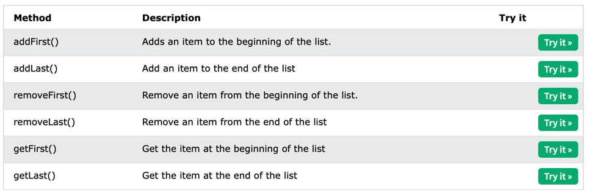

# Data structures

## String

### substring
```java
String s = "0123456789";
// Returns a new string which is the substring of a specified string
String sub = s.substring(1,4)
// sub -> "123" (1-inclusive, 4-exclusive)
sub = s.substring(6)
//sub -> "6789"
```

### compare
compareTo returns:
- An int value: 0 if the string is equal to the other string.
- < 0 if the string is lexicographically less than the other string
- \> 0 if the string is lexicographically greater than the other string (more characters)
```java
s1.compareTo(s2);
s1.compareToIgnoreCase(s2);
```
### equals
```java
s1.equals(s2);
s1.equalsIgnoreCase(s2);
```
### Array of chars
```java
char[] chars = s1.toCharArray();
```
### locating chars/sequences
```java
// Returns the position of the last found occurrence of 
// specified characters in a string
lastIndexOf()
// Returns the position of the first found occurrence of 
// specified characters in a string
indexOf(int char, int fromIndex)
indexOf(String str
```
### replace
```java
// returns A new String, where the specified character
// has been replaced by the new character(s)
String myStr = "Hello";
System.out.println(myStr.replace('l', 'p'));

//Replaces the first occurrence of a substring that matches the
// given regular expression with the given replacement
replaceFirst()
        
//Replaces each substring of this string that matches the given regular expression 
// with the given replacement
replaceAll()
String replaceString=s1.replaceAll("a","e");//replaces all occurrences of "a" to "e"  

```
### split
```java
String s = "Welcome to Baeldung";
String[] expected1 = new String[] { "Welcome", "to", "Baeldung" };
String[] expected2 = new String[] { "Welcome", "to Baeldung" };
    
assertArrayEquals(expected1, s.split(" "));
assertArrayEquals(expected2, s.split(" ", 2));
```
## Array
(Arrays class)
### to list
```java
String a[] = new String[] { "A", "B", "C", "D" };
// Getting the list view of Array
List<String> list = Arrays.asList(a);
```
### fill
```java
int ar[] = {2, 2, 1, 8, 3, 2, 2, 4, 2};
// To fill complete array with a particular value
Arrays.fill(ar, 10);
```
### sort
```java
int numbers[] = {2, 2, 1, 8, 3, 2, 2, 4, 2};

// Using Arrays.parallelSort()
Arrays.parallelSort(numbers);
//or 
Arrays.sort(numbers)
```
## Lists
### modify an element
```java
cars.set(0, "Opel");
```
### remove an element
```java
cars.remove(0);
```
### clear a list
```java
cars.clear();
```
## LinkedList


## Stack
### initialise
```java
Stack<E> stack = new Stack<E>();
```
### push
```java
stack.push(x);
```
### pop
```java
Integer y = stack.pop();
```

### peek
Displaying element on the top of the stack
```java
Integer element = (Integer) stack.peek();
```
### search
```java
Integer pos = (Integer) stack.search(element);
  
if(pos == -1)
    System.out.println("Element not found");
else
    System.out.println("Element is found at position: " + pos);
```
## Queue
### initialise
```java
PriorityQueue<Integer> pq = new PriorityQueue<>();
```
### add
```java
pq.add(1);
```
### get first
```java
System.out.println("head: "+pq.peek());
```

### iterate
```java
Iterator itr=pq.iterator();
while(itr.hasNext()){
    System.out.println(itr.next());
}
```

### poll
kinda like pop but from the other side
```java
System.out.println("queue poll: " + pq.poll());
```

## Hash map
### initialise and add items
```java
HashMap<String, String> capitalCities = new HashMap<String, String>();

// Add keys and values (Country, City)
capitalCities.put("England", "London");
capitalCities.put("Germany", "Berlin");
capitalCities.put("Norway", "Oslo");
capitalCities.put("USA", "Washington DC");
System.out.println(capitalCities);
```
### access an item
```java
capitalCities.get("England");
```

### remove an item
```java
capitalCities.remove("England");
```
### clear
```java
capitalCities.clear();
```
### iterate
```java
for (String i : people.keySet()) {
    System.out.println("key: " + i + " value: " + people.get(i));
}
```

### contains?
```java
// returns true or false
map.containsKey(4);
map.containsValue("aaaa");
```
## Hash set
A HashSet is a collection of items where every item is unique
```java
public class Main {
  public static void main(String[] args) {
    HashSet<String> cars = new HashSet<String>();
    cars.add("Volvo");
    cars.add("BMW");
    cars.add("Ford");
    cars.add("BMW");
    cars.add("Mazda");
    System.out.println(cars);
  }
}
```

### item exists?
```java
cars.contains("Mazda");
```

### remove
```java
cars.remove("Volvo");
```
