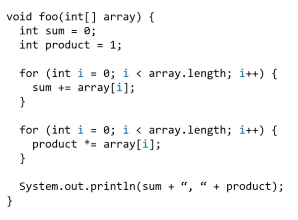
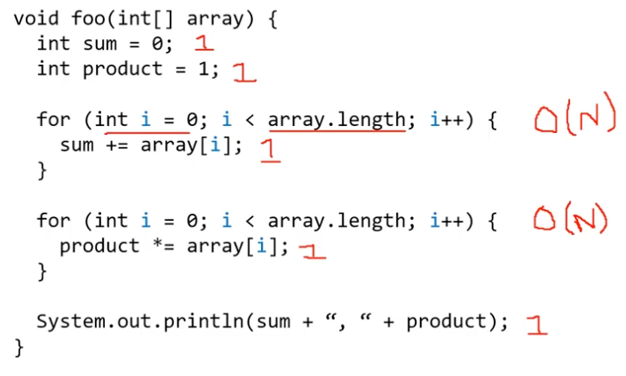

# Big O examples

## example 1

1. find the meaning of the code
   1. finding sum
   2. finding product
2. analyse the loops
   1. two for loops
3. anytime there is a mathematical operation/assignment, they are constant time -> O(1)
4. for loops are linear time -> O(N)

5. N + N +5 -> drop all the constants
6. Complexity: O(N)

## example 2
