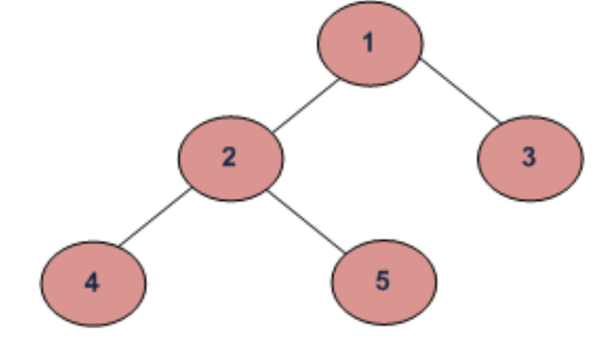

# Depth First Search
Similarly to breadth first search, this is also an algorithm used to traverse through tree or graph structures.


The algorithm starts at the root node (selecting some arbitrary node as the root node in the case of a graph) 
and explores as far as possible along each branch before backtracking. Extra memory, usually a stack, 
is needed to keep track of the nodes discovered so far along a specified branch which helps in backtracking of the graph.

## non-recursive pseudocode
```
procedure DFS_iterative(G, v) is
    let S be a stack
    S.push(v)
    while S is not empty do
        v = S.pop()
        if v is not labeled as discovered then
            label v as discovered
            for all edges from v to w in G.adjacentEdges(v) do 
                S.push(w)
```

## trees: types of traversal:

1. Inorder (Left, Root, Right) : 4 2 5 1 3
2. Preorder (Root, Left, Right) : 1 2 4 5 3
3. Postorder (Left, Right, Root) : 4 5 2 3 1
