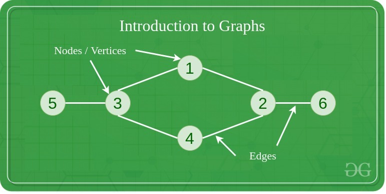
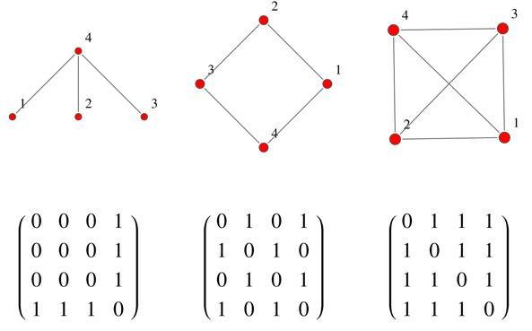
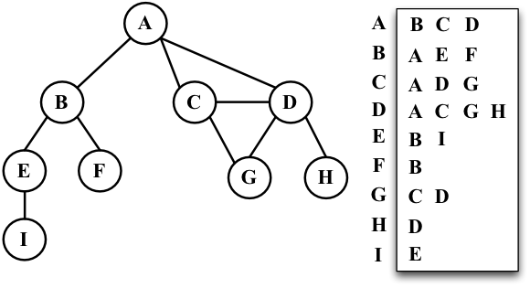

# ⚯ Graphs ⚯
## what are they?

- non-linear data structure
- consisting of:
  - vertices (nodes). They can be:
    - labelled
    - unlabelled
  - edges (lines that connect the vertices). They can be:
    - labelled
    - unlabelled
- The graph is denoted by G(E, V)
- In a directed graph, if edge goes from node a to b, it doesn't mean that it goes from b to a.
- In undirected graph, if an edge connects a to b it also connects b to a.

### example of usage
Graphs are used to represent networks. The networks may include paths in a city or telephone network or circuit network.
Graphs are also used in social networks like linkedIn, Facebook. For example, in Facebook, each person is represented 
with a vertex(or node). Each node is a structure and contains information like person id, name, gender, and locale.

## Graph representation 
(common forms, there is more like, Incidence Matrix and Incidence List)

### Adjacency Matrix
- 2D array of size V x V
- V is the number of vertices in a graph
- If a slot adj[i][j] = 1, it indicates that there is an edge from vertex i to vertex j.
- Adjacency matrix for undirected graph is always symmetric.

### Adjacency List
An array of lists is used. The size of the array is equal to the number of vertices. 
Let the array be an array[]. An entry array[i] represents the list of vertices adjacent to the ith vertex.

### references
1. [Graph Data Structure - introduction](https://www.geeksforgeeks.org/graph-data-structure-and-algorithms/), accessed on 4.09.2022
2. [Graph Data Structure - representations](https://www.geeksforgeeks.org/graph-and-its-representations/), accessed on 4.09.2022
3. [Adjacency Matrix](https://mathworld.wolfram.com/AdjacencyMatrix.html), accessed on 4.09.2022
4. [Adjacency List](https://www.oreilly.com/library/view/learning-javascript-data/9781788623872/ef9a9b77-a6d4-480b-a4f4-77336f587b36.xhtml), accessed on 04.09.2022ß